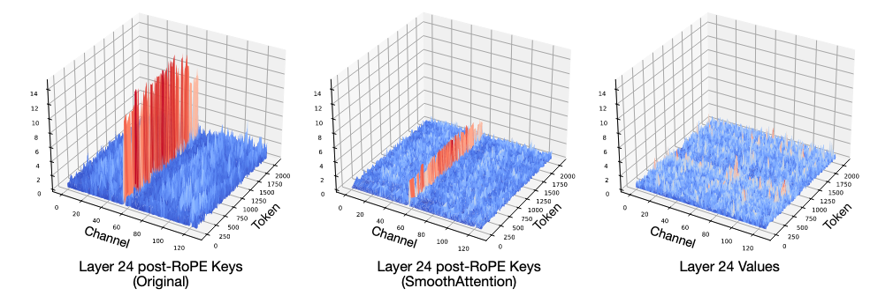
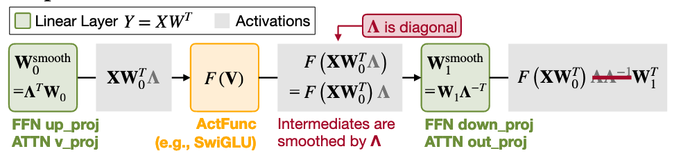

# QServe: W4A8KV4 Quantization and System Co-design for Efficient LLM Serving
从这篇文章出发了解一下模型量化技术：[QServe](https://arxiv.org/pdf/2405.04532)
<!-- more -->

## Background-Quantization
Quantization makes some parameters in LLM smaller to optimize the memory usage. the process of **quantization** is: 

$$
\mathbf{Q}_{\mathbf{X}} = \left\lceil \frac{\mathbf{X}}{s} + z \right\rfloor, \quad 
s = \frac{\mathbf{X}_{\max} - \mathbf{X}_{\min}}{q_{\max} - q_{\min}}, \quad 
z = \left\lceil q_{\min} - \frac{\mathbf{X}_{\min}}{s} \right\rfloor
$$

## Motivation
Existing methods of quantization can be divided into 3 categories:
 - W4A16 (per-group quantization)
 - W8A8 (per-channel for W and per-token for A)
 - W4A4 (per-group quantization)

!!! quote

    Weight and KV cache quantization (e.g. W4, KV4) can reduce the memory footprint in LLM serving. Quantizing both weight and activation (e.g. W8A8) can also improve the peak computation throughput. Choosing the right precision for LLM deployment is a difficult task. Existing solutions can be divided into three categories: W4A16 (pergroup), W8A8 (per-channel weight + per-token activation), W4A4 (per-group). We will demonstrate in this section why **W4A8KV4** is a superior choice.

### Why W4A8KV4?

The experiments in this paper are evaluated on the A100:

W4A8KV4: 
1. higher throughput (Compared to W8A8 & FP16 & W4A16)
2. higher Bandwidth (Compared to W4A8 withou KV4)
3. lower accuracy loss (Compared to W4A4)
4. without CUDA core's limitation (Compared to W4A4 in Atom & W4A16 in TRTLLM)
   
### QoQ

#### Progressive Group Quantization

We first apply _per-channel symmetric_ `INT8` quantization: 

$$
\hat{\mathbf{W}}=\mathbf{Q}_{{\mathbf{W}_{s8}}}^{(0)}\cdot\mathbf{s}_{{\mathrm{fp}16}}^{(0)},
$$

Then, we then employ _per-group asymmetric_ `INT4` quantization:
$$
\mathbf{Q_{W_{s8}}}^{(0)}=(\mathbf{Q_{W_{u4}}}-\mathbf{z_{u4}})\cdot\mathbf{s_{u8}}^{(1)},$$

where $\mathbf{s_{u8}}^{(1) \in \mathbb{R}^{n \times k/g}}$ is the unsigned 8-bit **group-wise** quantization scales.

##### Protective Quantization Range

Naively applying these 2 quantization will have out-of-bounds risks.
(Easy to be proved. )
Therefore, we shrink the `INT8` symmetric range from [-127, 127] to [-119, 119].

##### Compared to previous two-level quantization

Prior studies introduces 2-level quantization in the group-wise scaling factors to reduce the memory footprint.
As a result, $Q_{w_{s4}}$ is directly dequantized to `FP16`:

$$
\hat{\mathbf{W}}=\mathbf{Q}_{\mathbf{W}_{\mathrm{s}4}}\cdot\mathbf{s}_{\mathrm{fp}16},\quad\mathbf{\hat{s}}_{\mathrm{fp}16}=\mathbf{s}_{\mathrm{u}8}^{(1)}\cdot\mathbf{s}_{\mathrm{fp}16}^{(0)}
$$
Drawbacks: 
1. DGQ: seperated kernels
2. QLoRA: failed to use Tensor Core

#### SmoothAttention

Key Observation: **the Value matrices show no significant outlier pattern,  whereas Key matrices tend to have fixed outlier channels in each head.**

$$
\mathbf{Z}=\left(\mathbf{Q}\boldsymbol{\Lambda}\right)\cdot\left(\mathbf{K}\boldsymbol{\Lambda}^{-1}\right)^{T},\quad\boldsymbol{\Lambda}=\mathrm{diag}\left(\lambda\right) ,\quad
\lambda_i=\max\left(|\mathbf{K}_i|\right)^\alpha.
$$

To be compatible with ROPE, 
$$
\lambda_i=\lambda_{i+\frac D2}=\max\left(\max\left(|\mathbf{K}_i|\right),\max\left(|\mathbf{K}_{i+\frac D2}|\right)\right)^\alpha 
$$

#### General optimizations
##### 1. Input Module Rotation

!!! quote
    
    We rotate the corresponding weights accordingly in the reversed direction. After rotation, each channel’s activations are linear combinations of all other channels, and thus outlier channels are effectively suppressed. Furthermore, since rotation is a unitary transformation, we can fuse the rotation matrix with the previous linear layers’ weights. We simply choose the scaled **Hadamard matrix** as the rotation matrix.

##### 2. Ouput Module Smoothing

smooth matrix $\Lambda$ is calculated in [SmoothQuant](https://arxiv.org/pdf/2211.10438):

$$
\mathbf{\lambda }_j=\max(|\mathbf{X}_j|)^\alpha/\max(|\mathbf{W}_j|)^{1-\alpha}
$$

In QServe's implementation, $\alpha$ which is nearly 0 is better.

##### 3. Activation Channel Reordering

!!! quote

    We use max ($|\mathbf{X}|$) to determine the channel salience, and then reorder channels so that channels with similar salience are in the same quantization group.

### QServe Serving System